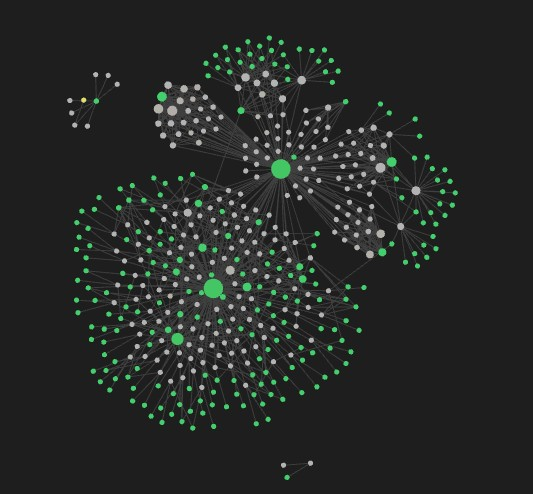

<p align="center">
  
</p>

<h1 align="center">SQL Sentinel</h1>

<p align="center">
  Real-time monitoring for Microsoft SQL Server environments.<br/>
  Built for DBAs and Data Engineers managing tens or hundreds of instances.
</p>

---

**SQL Sentinel** provides a centralized dashboard for real-time visibility into the health
of servers, databases, sessions, backups, and Always On clusters — without
having to open SSMS on every individual server.

---

## Key Features

### Monitoring

- **Global dashboard** — overview of all servers with aggregated KPIs, CPU/memory status,
  active alarm count, online/offline donut chart, and top-server CPU chart
- **Single server dashboard** — detailed metrics, CPU/memory history (ring buffer,
  60 points), database list, active sessions, blocking, SQL Agent jobs, Wait Stats, and Disks
- **Always On AG** — cluster monitoring with PRIMARY/SECONDARY replica status,
  sync health, and real-time connectivity; clicking a replica navigates directly
  to that server's dashboard; AG header with dual-click zones (expand/collapse separate from navigation)
- **Persistent metrics history** — snapshots per server saved to SQL Server 2025 and
  automatically restored on startup; charts and KPIs are available without waiting
  for the first polling cycle
- **Stale-while-revalidate** — when switching servers the UI immediately shows cached data
  while a silent background fetch completes; non-blocking `LinearProgress`

### Inventory and data

- **Server View** — server inventory with composable filters: environment, hosting,
  AG, alias, owner, SQL Server version; CSV export with UTF-8 BOM for Excel
- **DB View** — one row per database per server; columns: DATABASE · SERVER ·
  ALIAS · STATUS · RECOVERY · COMPAT · TDE · DATA · LOG · LAST FULL · LAST LOG · OWNER · CREATED;
  KPI cards: Total DBs · Online · Offline · Full Recovery · TDE Active · No Backup · Compat < 2016;
  filters: recovery model · TDE · compat level · offline only · no backup >24h only
- **Multi-instance** — multiple SQL Server instances on the same physical machine grouped
  under a collapsible "🖥 MACHINE (N instances)" header in the Sidebar and Inventory
- **Custom DB fields** — owner field and other per-database custom metadata,
  persisted in SQL Server; visible in Inventory, Dashboard, and CSV export
- **Server notes** — free-text field (max 1000 characters) with 1s autosave per server;
  visible in the Overview tab and as a column in Inventory

### Alarms

- **Automatic detection** — offline databases, expired backups, blocked sessions,
  CPU/memory thresholds; cap of 500 alarms / 7 days
- **Email notifications** — WARNING and CRITICAL alerts send HTML emails via SMTP with
  15-minute deduplication per (server, category) pair; template with level-colored header
- **Windows toast notifications** — CRITICAL alerts sent as system toasts when
  the window is hidden in the tray; 15-minute cooldown; can be disabled from Settings

### Discovery and management

- **Network discovery** — CIDR subnet scanning via TCP port scan (500ms timeout per host)
- **Manual addition** — direct `host:port:instance` entry with connection test
- **Grouping** — servers organized by environment (Production / Staging / Development)
  and by custom groups with drag-and-drop; configurable alias and owner
- **Custom groups** — sidebar with group manager, server alias rename,
  persistent expand/collapse state

### AI Assistant

- **Integrated AI chat** — LangGraph agent with access to the live context of all servers
  (metrics, alarms, databases); answers questions about infrastructure status
- **RAG Knowledge Base** — indexing of technical documentation (PDF/Markdown) stored in
  SQL Server 2025 with native `vector(1536)` embeddings and DiskANN approximate nearest
  neighbour index; the agent incorporates indexed knowledge in its responses



- **Ollama support** — local models via Ollama (no data sent to the cloud)

### Background and tray

- **System tray** — the app hides to the tray instead of closing; double-click
  or context menu to restore it; "Exit" to quit completely
- **Background polling** — the worker keeps running with the window hidden;
  _Light_ mode (only 4 critical queries, history cap 3) or _Full_ mode (unchanged)
- **Pause on hidden window** — AgDashboard charts and renderer polling stop
  automatically when the window is not in the foreground (`visibilitychange`)
- **Start with Windows** — toggle in Settings; uses `app.setLoginItemSettings`

### Security and authentication

- **Local login** — bcrypt 12 rounds, in-memory session 8h with sliding expiry;
  mandatory password change on first login; session tokens stored as SHA-256 hash
  in SQL Server (DB dump never reveals a live token)
- **Credentials encrypted at rest** — SQL Server connection passwords encrypted with
  `safeStorage` (Windows DPAPI / macOS Keychain / Linux Secret Service);
  automatic migration from plaintext on first launch
- **TLS configurable** — per-connection `encrypt` and `trustServerCertificate` options
  for both the storage database and monitored servers
- **IPC auth guard** — all sensitive IPC channels require a valid session;
  exempt channels declared explicitly (storage setup wizard runs before login)

### Settings

- **Dark / Light / System theme** — follows the OS preference in real time;
  dark mode with slate palette and accent tinted border on KpiCard
- **Metrics retention** — configurable from Settings; automatic cleanup every 24h
  (value `0` = keep forever)
- **Storage database** — SQL Server 2025 connection editable from Settings with
  live test before saving
- **SMTP configuration** — host, port, TLS/STARTTLS, recipient list up to 20 addresses
- **Background & Tray** — polling intervals, background mode, system notifications

---

## Architecture

```text
Electron (main process)
├── PollingManager   concurrent scheduler, max 30 parallel fetches
│   ├── ACTIVE       60s   currently displayed server
│   ├── IDLE         300s  background server
│   └── OFFLINE      600s  unreachable server
│       └── Circuit breaker  exponential back-off, cap 1 hour
├── SQL Collector    T-SQL queries via tedious (AbortSignal 90s per fetch)
│                    supports Windows Auth and SQL Auth
│                    SQL errors sanitized (no credentials in logs)
├── AG Detector      Always On replica role detection and sync
│                    throttled every 5 polls; pushes SERVER_CONFIG_UPDATED to renderer
├── Delta IPC        batch coalescing 50ms (setTimeout macrotask)
│                    sends only changed DBs to the renderer
│                    threshold: ≤5 changed DBs or ≤20% of total
├── IPC Layer        handlers split by domain (servers/metrics/alarms/knowledge/system/storage)
│                    authenticated handleWrapper on all channels
│                    Service layer (ServerService, SystemService) for business logic
├── SQL Server 2025  application storage database (separate from monitored servers)
│   ├── metrics_snapshots   server metrics history, indexed (server_id, collected_at)
│   ├── settings            key/value app configuration
│   ├── db_custom_fields    per-database alias and owner metadata (in-memory cache)
│   ├── users / sessions    bcrypt auth; tokens stored as SHA-256 hash
│   ├── rag_documents       indexed document registry
│   └── rag_chunks          vector(1536) embeddings with DiskANN ANN index
├── electron-store   serverStore.ts — server list (JSON, DPAPI-encrypted passwords)
└── Logger           structured logger [TIMESTAMP][LEVEL][scope] — main + renderer
                     debug suppressed in production

React Renderer
├── Zustand + Immer  reactive store, in-place mutations
│                    re-renders only for the updated server
├── api/ipc.ts       typed wrapper on window.sqlSentinel with 5s timeout (30s for collect)
│                    single IPC access point across the entire renderer
├── Two-tier metrics lightweight summary (~128B) for all servers
│                    full data only for the active server
├── React.memo       memoized sub-components (ServerRow, KpiCard, SidebarTree items…)
│                    stable callbacks via useCallback — no re-renders
│                    on polling ticks that do not change the visible server
├── Ring buffer      cpuHistory / memoryHistory
│                    cap 60 points active server / 10 points idle
├── @tanstack/virtual  server list virtualization (200+ servers)
└── Hooks            useDebouncedValue · useIpcEvent · useVisibilityPoll · useRefreshAllServers
```

**Scale target: 200 servers / 1500 databases monitored in real time.**

---

## Security

| Area                | Mechanism                                                                          |
| ------------------- | ---------------------------------------------------------------------------------- |
| Local auth          | bcrypt 12 rounds, in-memory session 8h, token stored as SHA-256 hash in SQL Server |
| IPC auth            | Every IPC channel requires authentication; exempt channels declared explicitly     |
| Credentials         | Encrypted at rest with `safeStorage` (Windows DPAPI / macOS Keychain)             |
| TLS                 | `encrypt` and `trustServerCertificate` configurable per connection                 |
| SQL errors          | `sanitizeSqlError()` strips host, port, and credentials before logging             |
| Path traversal      | PDF filenames validated with `SAFE_PDF_NAME` regex before `path.join()`            |
| TCP scan            | Explicit handshake timer (500 ms) — avoids pending sockets on filtered ports       |
| Parameterization    | All T-SQL queries use parameters — no SQL string concatenation                     |
| Sandbox             | `contextIsolation: true`, `nodeIntegration: false`, `sandbox: false` main only     |

---

## Installation

### Requirements

#### Monitored servers

| Requirement       | Detail                                                    |
| ----------------- | --------------------------------------------------------- |
| SQL Server        | 2014 or later                                             |
| Authentication    | Windows Auth or SQL Auth                                  |
| Network           | Configured TCP port reachable from the monitoring machine |
| Agents on servers | Not required                                              |

#### Storage database (SQL Sentinel's own data)

| Requirement      | Detail                                                                         |
| ---------------- | ------------------------------------------------------------------------------ |
| SQL Server       | **2025** (required for native `vector(1536)` and DiskANN — AI features)        |
| Authentication   | SQL Auth recommended (`sqlsentinel_app` user with `db_owner` on the target DB) |
| Network          | Reachable from the machine running SQL Sentinel                                |

> The storage database can be a separate SQL Server 2025 instance from the servers
> being monitored. A local Docker container works well for development.

#### Application host

| Requirement      | Detail                              |
| ---------------- | ----------------------------------- |
| Operating system | Windows 10 / 11 x64                 |
| Dependencies     | None — SQL Sentinel is self-contained |

### Installer-based installation

1. Download `SQL Sentinel Setup x.x.x.exe`
2. Run the installer and follow the setup wizard
3. Launch **SQL Sentinel** from the Start menu or desktop

> The first time, Windows may show "Unknown Publisher"
> → click **Run anyway**

### Portable installation

1. Extract the `win-unpacked\` folder
2. Run `sqlsentinel.exe` directly — no installation required

---

## First Launch

### 1. Storage database setup

On first launch, SQL Sentinel shows a **Storage Database** wizard before the login screen.
Fill in the connection details for your SQL Server 2025 instance:

| Field          | Default           | Description                                  |
| -------------- | ----------------- | -------------------------------------------- |
| Host           | `localhost`       | SQL Server hostname or IP                    |
| Port           | `1437`            | TCP port (non-default to avoid collision)    |
| Database       | `SQLSentinelDB`   | Target database (created automatically)      |
| Username       | `sqlsentinel_app` | SQL Auth user with `db_owner` role           |
| Password       |                   | SQL Auth password                            |
| Encrypt (TLS)  | off               | Enable for remote/production deployments     |
| Trust cert     | on                | Allow self-signed certificates               |

Click **Test Connection** first, then **Save & Continue** (enabled only after a successful test).
SQL Sentinel creates all required tables automatically on first run.

> To change the connection later, go to **Settings → Storage Database → Edit**.

### 2. Login

After storage is configured, sign in with the default credentials:

| Field    | Value        |
| -------- | ------------ |
| Username | `admin`      |
| Password | `Admin1234!` |

You will be immediately prompted to change your password (minimum 8 characters, 1 uppercase, 1 number).

### 3. Adding a server

1. Go to the **Discovery** tab
2. Click **Add server manually**
3. Fill in the fields:

| Field          | Example                                       |
| -------------- | --------------------------------------------- |
| Host           | `192.168.1.10` or `localhost`                 |
| Port           | `1433` (default) or any configured TCP port   |
| Named instance | `SERVER\SQLEXPRESS`                           |
| Authentication | Windows Auth (recommended) or SQL Auth        |
| Environment    | Production / Staging / Development            |
| Alias          | Descriptive name e.g. `SQL-PROD-01`           |
| Owner          | Name of the person responsible for the server |

4. Click **Test connection** to verify connectivity
5. Click **Add** — the server appears in the sidebar and polling starts automatically

### 4. Verifying SQL Server configuration on monitored servers

If the connection fails, verify the following on each monitored server:

```powershell
# TCP/IP enabled in SQL Server Configuration Manager
# → SQL Server Network Configuration
# → Protocols → TCP/IP → Enabled

# TCP port open in the firewall (replace 1433 with the configured port)
New-NetFirewallRule -DisplayName "SQL Server TCP" `
  -Direction Inbound -Protocol TCP `
  -LocalPort 1433 -Action Allow

# Quick connection test (replace 1433 with the actual port)
sqlcmd -S localhost,1433 -E -Q "SELECT @@SERVERNAME, @@VERSION"
```

> **Note:** SQL Server Browser (UDP 1434) is not required or supported.
> Any TCP port is supported — specify it in the **Port** field when
> adding the server. Named instances must use a fixed TCP port.

---

## Building from Source

### Development prerequisites

- Node.js v22+ (LTS)
- npm v10+
- Windows 10/11 x64
- SQL Server 2025 instance for the storage database (see Docker setup below)

### Setup

```bash
git clone https://github.com/MrCorte/SQLSentinel.git
cd SQLSentinel
npm install
```

### macOS development setup

For local development on macOS, the repository includes a bootstrap script that:

- enforces Node.js 22
- starts a local **SQL Server 2025** container via Docker (port 1437, `SQLSentinelDB`)
- installs npm dependencies
- optionally installs and pulls Ollama for AI features

```bash
cd SQLSentinel
./scripts/setup-mac-dev.sh
```

Optional AI bootstrap:

```bash
./scripts/setup-mac-dev.sh --with-ollama
```

Local storage database for development:

| Field    | Value                                       |
| -------- | ------------------------------------------- |
| Host     | `localhost`                                 |
| Port     | `1437`                                      |
| Database | `SQLSentinelDB`                             |
| User     | `sqlsentinel_app`                           |
| Password | `App@Sentinel2025`                          |
| Image    | `mcr.microsoft.com/mssql/server:2025-latest` |

The script expects Homebrew and Docker Desktop to be available.
If your shell resolves a different Node version, use `.nvmrc` (`22`) or put
`/opt/homebrew/opt/node@22/bin` before other Node installations in `PATH`.

### Running in development

```bash
npm run dev
```

### Tests

```bash
npm test
```

Integration tests for the SQL Server storage layer require a running SQL Server 2025 instance:

```bash
STORAGE_TEST_HOST=localhost STORAGE_TEST_PORT=1437 npm test
```

Tests are skipped automatically when `STORAGE_TEST_HOST` is not set.

### Production build

```bash
# Typecheck + TypeScript build + Vite
npm run build

# Windows x64 packaging (includes typecheck automatically)
npm run build:win
```

Output in `dist\`:

```text
dist\
├── win-unpacked\
│   └── sqlsentinel.exe            ← portable
└── SQL Sentinel Setup x.x.x.exe  ← NSIS installer
```

---

## Project Structure

```text
src\
├── main\                          Electron main process
│   ├── ipc\
│   │   ├── handlers\              IPC handlers by domain
│   │   │   ├── servers.ipc.ts
│   │   │   ├── metrics.ipc.ts
│   │   │   ├── system.ipc.ts
│   │   │   ├── storage.ipc.ts     Storage DB setup wizard + config IPC
│   │   │   └── knowledge.ipc.ts
│   │   ├── handleWrapper.ts       Auth guard; storage channels are auth-exempt
│   │   └── index.ts               Handler registration
│   ├── services\                  Pure business logic (ServerService, SystemService)
│   ├── collectors\                T-SQL queries against monitored SQL Server instances
│   ├── store\
│   │   ├── sqlserver\             SQL Server 2025 repositories
│   │   │   ├── connection.ts      Connection pool — initStoragePool / getPool / testConnection
│   │   │   ├── database.ts        Schema DDL — idempotent IF NOT EXISTS, batched on startup
│   │   │   ├── metricsRepository.ts    Snapshots — batchSave (single INSERT), findLastNBulk
│   │   │   ├── settingsRepository.ts   Key/value app settings
│   │   │   ├── emailSettingsRepository.ts  SMTP config; password DPAPI-encrypted
│   │   │   ├── dbCustomFieldsRepository.ts  Per-DB metadata; warm in-memory cache
│   │   │   ├── usersRepository.ts      bcrypt users
│   │   │   ├── sessionsRepository.ts   SHA-256 token sessions; auto-expired by scheduler
│   │   │   └── ragRepository.ts        vector(1536) chunks; DiskANN similarity search
│   │   ├── storageConfig.ts       electron-store — SQL Server connection string (DPAPI)
│   │   └── serverStore.ts         electron-store — monitored server list (unchanged)
│   ├── ai\                        LangGraph agent, RAG indexer, Ollama client
│   ├── discovery\                 TCP scanner (explicit handshake timeout)
│   ├── utils\                     logger.ts (structured, levels, scope prefix)
│   └── metricsWorker.ts           Polling, delta IPC, AG throttle, AbortController
├── renderer\src\
│   ├── api\
│   │   └── ipc.ts                 Typed wrapper on window.sqlSentinel with timeout
│   ├── components\
│   │   ├── ui\                    StatusDot, TruncatedCell (reusable primitives)
│   │   ├── features\
│   │   │   ├── home\              KpiCard, ServerRow, ServerTable, charts + useHomeDashboard
│   │   │   ├── inventory\         InventoryGrid, filters, toolbar + useInventoryState
│   │   │   ├── metrics\           MetricsTabs + useMetricsData
│   │   │   └── sidebar\           SidebarTree, SidebarSearch, dialogs + useSidebarTree
│   │   └── layout\                Sidebar, HomeDashboard, MetricsPanel, AgDashboard (shell)
│   ├── hooks\                     useDebouncedValue · useIpcEvent · useVisibilityPoll · useRefreshAllServers
│   ├── store\                     Zustand: servers, metrics (applyDelta), alerts, groups, ag, ai, app
│   ├── utils\                     logger.ts, csvExportUtils, inventoryUtils, formatters
│   └── pages\
│       ├── StorageSetupPage.tsx   First-boot SQL Server wizard (shown before login)
│       ├── Login.tsx
│       ├── Settings.tsx           Includes Storage Database section with edit dialog
│       ├── Inventory.tsx
│       ├── Dashboard.tsx
│       └── Discovery.tsx
└── preload\                       Secure IPC bridge main ↔ renderer
    ├── index.ts                   contextBridge typed API as window.sqlSentinel
    └── index.d.ts                 Shared types (StoredServer, StorageConnectionParams…)
```
