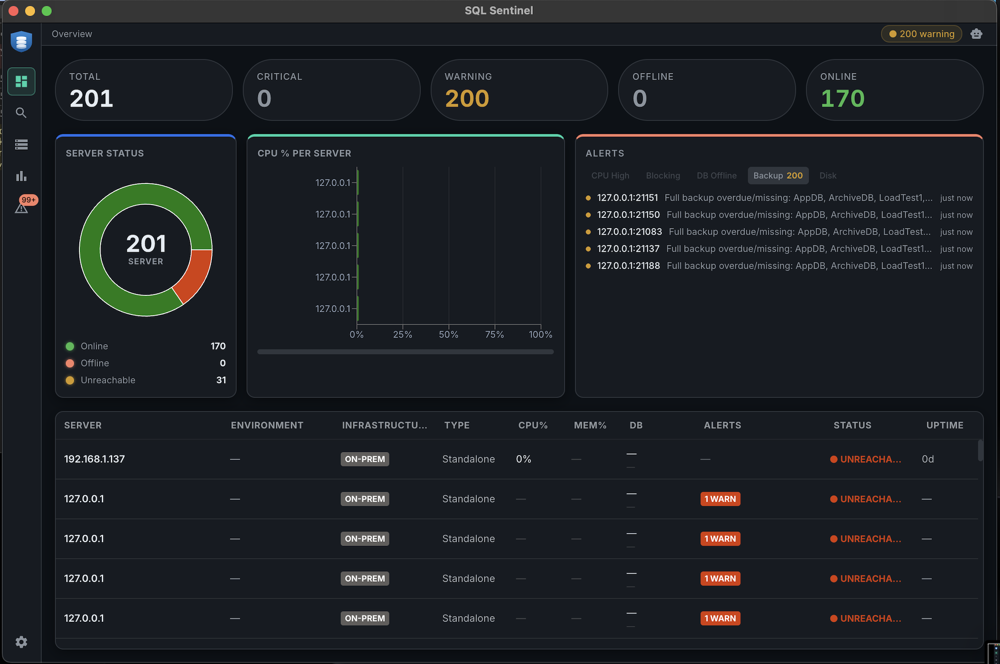
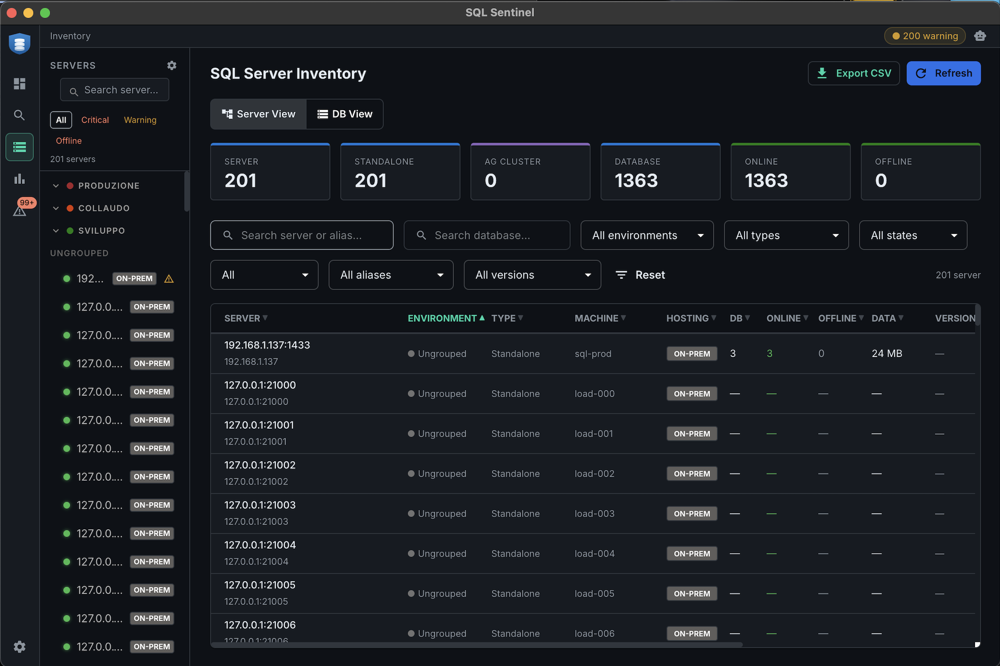
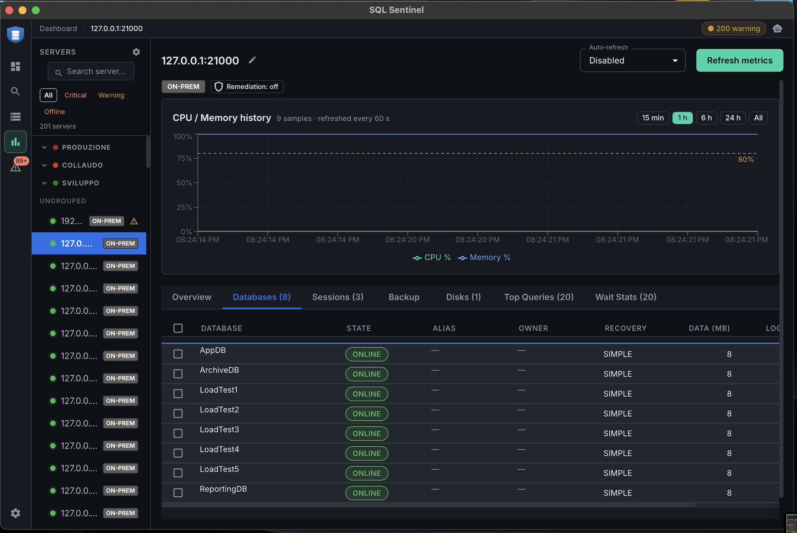
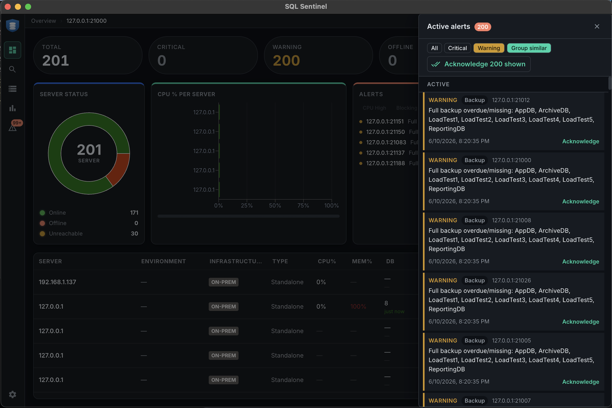
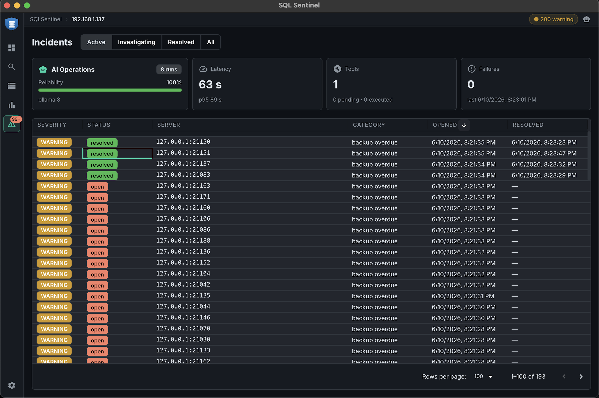

<p align="center">
  
</p>

<h1 align="center">SQL Sentinel</h1>

<p align="center">
  Real-time monitoring for Microsoft SQL Server fleets.<br/>
  Built for DBAs managing tens or hundreds of instances — validated against 200+ servers and 1,500+ databases.
</p>

<p align="center">
  
</p>

---

## What it does

SQL Sentinel discovers your SQL Server estate, polls health and performance metrics on an adaptive schedule, raises and auto-resolves alerts, opens incidents with AI-assisted root-cause analysis, and keeps the entire history in a SQL Server storage backend — all from a single desktop app that keeps working in the tray.

### Fleet overview

One screen for the whole estate: status donut, per-server CPU, active alerts, and a live server table with health derived from the collector's circuit breaker — a server is **online** only when real metrics are flowing, not merely when its TCP port answers.

### Inventory

Every server and every database, filterable and exportable. Composable filters (environment, type, version, state), custom per-database fields (alias, owner), CSV export, and a dedicated DB view that scales to thousands of databases.

<p align="center">
  
</p>

### Server dashboard

Per-server drill-down with CPU/memory history (persisted across restarts), and live tabs for Databases, Sessions, Backup status, Disks, Top Queries, and Wait Stats — all collected with least-privilege, parameterized, timeout-bounded T-SQL.

<p align="center">
  
</p>

### Alerts that clean up after themselves

Offline databases, overdue backups, blocking sessions, CPU/memory/disk thresholds. Alerts are deduplicated, **persisted to the storage database** (they survive restarts), and **auto-resolve** when the underlying condition clears — a backup taken means the overdue alert acknowledges itself and a later recurrence re-fires fresh. Notifications via email and Windows toast.

<p align="center">
  
</p>

### Incidents with AI root-cause analysis

Every alert can open an incident. An autonomous agent (Claude or local Ollama) runs read-only diagnostics, writes a root-cause summary, and — only behind a human-approval gate — proposes remediation. Full audit trail, exportable as a Markdown postmortem.

<p align="center">
  
</p>

### Everything else

- **Always On AG** — PRIMARY/SECONDARY replica status, sync health, automatic replica suggestion with credential inheritance
- **Discovery** — CIDR subnet scan or manual `host:port:instance`; server groups with drag-and-drop
- **AI Assistant** — streaming agent with live server context, RAG knowledge retrieval, and read-only diagnostic tools
- **RAG knowledge base** — DBA documentation and T-SQL recipes; hybrid FTS + semantic search with RRF fusion; feedback loop that promotes proven answers
- **Background polling** — keeps running in the tray; Light/Full mode; Start with Windows

> **Storage backend: SQL Server 2025.** All metrics history, server registry, alerts, knowledge base, AI feedback, and incidents live in a single SQL Server 2025 database. SQL Server 2025 is required for the native `vector` type used by the knowledge base embeddings.

---

## Built for scale

The screenshots above are not mock data — they come from a live load test: **201 registered servers, 1,363 databases**, polled continuously over real TDS connections.

| Component | Measured at 200 servers |
|---|---|
| Main process | ~7% CPU avg, 135 MB RSS |
| Renderer | 96% idle, 30 MB JS heap, fluid 200-row tables |
| Storage DB | ~3% CPU at steady state |
| Registration | 200 servers added (with credential encryption) in 0.6 s |

Polling is staggered across the interval window with a bounded concurrency of 30, exponential backoff per failing server, and batched metric persistence — at 200 idle servers the scheduler runs at under 3% of its capacity.

---

## Requirements

### Storage database *(SQL Sentinel's own data)*

| | |
|---|---|
| SQL Server | **2025** — required for the `vector` column type |
| Auth | SQL Auth — `db_owner` on the target database |

### Monitored servers

| | |
|---|---|
| SQL Server | 2014 or later |
| Auth | Windows Auth or SQL Auth |
| Network | TCP port reachable from the monitoring host; no SQL Server Browser needed |

### Application host

Windows 10 / 11 x64 — no additional dependencies.

---

## First Launch

### 1 — Storage setup wizard

On first launch, a wizard appears before the login screen. Enter the SQL Server 2025 connection details:

| Field | Default | |
|---|---|---|
| Host | `localhost` | |
| Port | `1437` | non-default to avoid collision with monitored instances |
| Database | `SQLSentinelDB` | created automatically |
| Username | `sqlsentinel_app` | |
| Encrypt (TLS) | off | enable for remote/production |
| Trust cert | on | allow self-signed certificates |

Click **Test Connection**, then **Save & Continue**. Tables and schema migrations are applied automatically — and validated in CI against a real SQL Server before every release.

The connection can be changed later in **Settings → Storage Database**.

### 2 — Login

A default `admin` account is created on first boot with a random password written to `admin-bootstrap.txt` in the app's data directory (file ACL-locked to your user). Log in, change the password (required), then delete the file.

### 3 — Add a server

Go to **Discovery → Add server manually**, fill in host, port and credentials, click **Test connection** (instance name and machine name are detected automatically), then **Save**.

---

## AI Architecture

SQL Sentinel embeds two AI workflows: a **conversational assistant** for on-demand diagnostics and an **incident agent** that fires automatically when an alert is raised. Both share the same provider abstraction, knowledge base, and feedback loop.

### Provider configuration

Two providers are supported, switchable in **Settings → AI**:

| Provider | Default model | When to use |
|---|---|---|
| **Ollama** (local) | `gemma4:e4b` | No API key needed; fully offline; lower latency on fast hardware |
| **Claude** (Anthropic) | `claude-haiku-4-5-20251001` | Higher reasoning quality; requires API key stored via OS keychain |

The Claude API key is encrypted at rest with Electron `safeStorage` (Windows DPAPI / macOS Keychain) and never leaves the machine in plaintext. Query text from monitored servers can be redacted before sending to Claude via **Settings → AI → Redact query text**.

Both providers implement automatic retry on transient failures. Claude uses the SDK's built-in retry (3 attempts, exponential backoff, respects `Retry-After` headers for 429 responses). Ollama retries each `invoke()` call up to 3 times with 1 s / 2 s / 4 s backoff for connection errors and 5xx responses.

### AI Assistant

The assistant is a streaming multi-turn agent that answers SQL Server diagnostic questions in natural language. On each query it: checks a response cache (longer TTL for answers the user has approved), gathers live context in parallel (fleet metrics, recent alerts, slow queries, schema), retrieves knowledge-base content and past approved Q&A pairs as few-shot examples, matches the question against curated T-SQL recipes, and only then calls the LLM — which can invoke read-only diagnostic tools in a multi-turn loop before answering.

Three invariants hold everywhere:

1. **SELECT-only** — the assistant never generates DML/DDL; T-SQL comes verbatim from curated recipe blocks, never invented.
2. **Structured context** — all injected data lives in delimited blocks (`<<SERVER_METRICS>>`, `<<KNOWLEDGE>>`, `<<TOOL_OUTPUT>>`) the model is instructed to treat as untrusted data, with a context-budget trimmer that always preserves the highest-value blocks.
3. **Read-only tools** — `get_server_metrics`, `get_recent_alerts`, `get_slow_queries`, `get_wait_stats`, `get_blocking_sessions`, `knowledge_retrieval`, `past_examples`; outputs capped at 8,000 chars.

### Incident Agent

Runs automatically on new alerts (deduplicated per instance + category; capped at 5 concurrent agents so an alert storm can't flood monitored servers). The agent selects diagnostic tools by alert category, produces "Root Cause" + "Recommended Fix" sections, and may propose a remediation action.

Any proposed action passes six layers of control before execution:

1. **Hard whitelist** — only `kill_session`, `update_statistics`, `rebuild_index` are proposable, enforced in code regardless of model output.
2. **Precondition checks** in TypeScript (e.g. `kill_session` rejects SPID ≤ 50 and protected logins).
3. **Safe T-SQL generation** — parameterized values, bracket-quoted identifiers; the model never writes the execution SQL.
4. **Rate limits** — max 3 actions per incident, 10 per hour globally; one Settings toggle disables everything.
5. **Human approval gate** — the exact T-SQL is shown before Approve.
6. **Pre-execution re-check** of preconditions at approval time.

Every run is audited: provider, model, SHA-256 of prompt/response, token counts, tool calls — stored in an immutable event log.

### Knowledge Base & RAG

Curated **DBA cards** (T-SQL recipes) and **knowledge chunks** (documentation) are retrieved with a hybrid of in-memory full-text search and semantic search (`nomic-embed-text` via local Ollama, 768-d vectors), merged with Reciprocal Rank Fusion; the top 4 results ground every answer.

User feedback closes the loop: a 👍 stores the question's embedding and makes that Q&A a few-shot example for similar future questions; a 👎 retracts it. Questions with 3+ upvotes can be promoted to permanent T-SQL recipes with aliases — turning common questions into instant deterministic lookups that bypass the LLM entirely.

---

## Building from Source

```bash
git clone https://github.com/MrCorte/SQLSentinel.git
cd SQLSentinel
npm install
npm run dev        # development + HMR
npm run build      # typecheck + production build
npm run build:win  # Windows .exe + NSIS installer
```

**Prerequisites:** Node.js 22+, npm 10+, Windows 10/11 x64, SQL Server 2025 instance.

### Docker (development environment)

Copy the example env file and set passwords, then start all containers:

```bash
cp docker/.env.example docker/.env
# edit docker/.env with your passwords
docker compose -f docker/docker-compose.yml up -d
docker compose -f docker/docker-compose.yml up -d sql-init  # first time only
```

This starts five SQL Server containers (Production, Dev, Staging, DR, and the SQLSentinel storage backend on port 1437).

For a minimal single-container setup (storage only):

```bash
docker run -e ACCEPT_EULA=Y -e MSSQL_SA_PASSWORD=<yourpassword> \
  -p 1437:1433 --platform linux/amd64 \
  mcr.microsoft.com/mssql/server:2025-latest
```

### Tests

Three layers, because unit tests alone can't see the bugs that matter most in a tool like this:

```bash
# Unit tests (mocked storage, no SQL Server needed)
npm test

# Schema + migration integration tests — runs initSchema and every migration
# against a REAL SQL Server, including the upgrade path on a populated table
SQLSENTINEL_IT_HOST=localhost SQLSENTINEL_IT_PORT=1437 \
SQLSENTINEL_IT_USER=sa SQLSENTINEL_IT_PASSWORD=<yourpassword> \
npm run test:integration

# E2E smoke test — boots the BUILT app, verifies storage init succeeds and
# the renderer actually paints (catches broken migrations, white screens)
npm run build && npm run test:smoke
```

---

## Security

| Area | Mechanism |
|---|---|
| Auth | bcrypt 12 rounds; in-memory session 8h; tokens stored as SHA-256 hash; per-user lockout after repeated failures |
| Credentials | `safeStorage` (Windows DPAPI / macOS Keychain) for SQL credentials and Claude API key |
| TLS | `encrypt` + `trustServerCertificate` configurable per connection |
| IPC | Auth guard on all channels; storage wizard channels explicitly exempt pre-login only |
| SQL | Parameterized queries only — no string concatenation anywhere |
| Sandbox | `contextIsolation: true`, `nodeIntegration: false`; strict CSP (header + meta) in production builds |
| AI actions | Hard whitelist (3 operations), precondition checks, rate limits, human approval gate, pre-execution re-check |
| Service | Local HTTP + WebSocket service binds to `127.0.0.1` only; Bearer token auth; loopback-only enforcement at middleware level |
