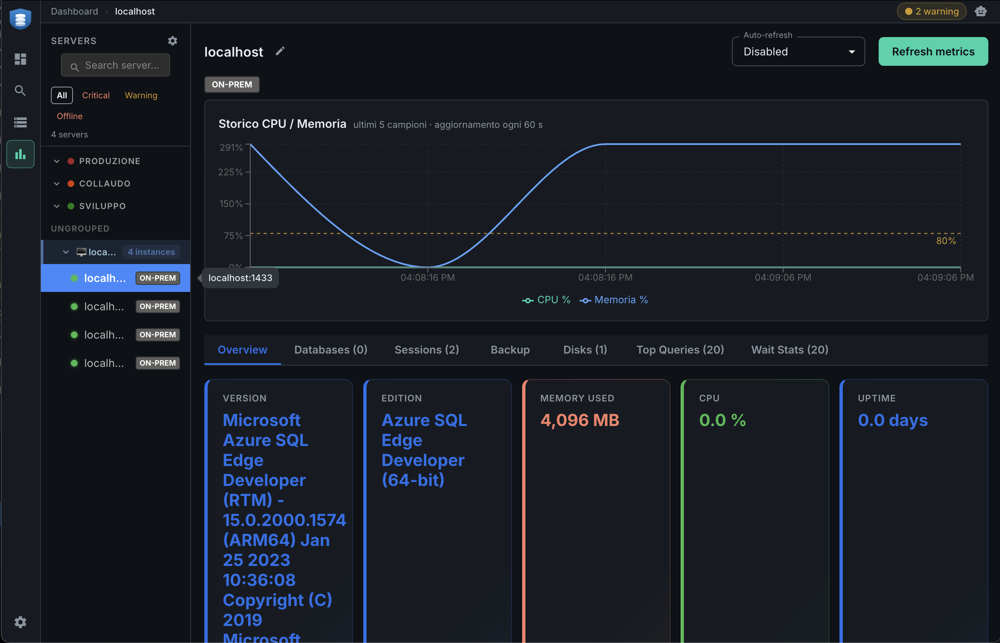

<p align="center">
  
</p>

<h1 align="center">SQL Sentinel</h1>

<p align="center">
  Real-time monitoring dashboard for Microsoft SQL Server environments.<br/>
  Built for DBAs managing tens or hundreds of instances.
</p>

<p align="center">
  
</p>

---

## Features

- **Global dashboard** — aggregated KPIs, CPU/memory, alarm count, top-server charts
- **Server dashboard** — metrics history, databases, sessions, blocking, Wait Stats, Disks, SQL Agent jobs
- **Always On AG** — PRIMARY/SECONDARY replica status, sync health, real-time connectivity
- **Inventory** — composable filters, custom DB fields (alias, owner), CSV export
- **Alerts** — offline DBs, expired backups, blocked sessions, CPU/memory thresholds; email + Windows toast
- **Discovery** — CIDR subnet scan or manual `host:port:instance`; server groups with drag-and-drop
- **AI Assistant** — streaming agent (Claude or local Ollama) with live server context, RAG knowledge retrieval, and read-only diagnostic tools
- **Incident agent** — autonomous root-cause analysis triggered by alerts, with a human-approval gate before any action is executed
- **RAG knowledge base** — DBA documentation and T-SQL recipes embedded with `nomic-embed-text`; hybrid FTS + semantic search with RRF fusion; feedback loop that progressively promotes proven answers
- **Background polling** — keeps running in the tray; Light/Full mode; Start with Windows

> **Storage backend: SQL Server 2025.** All metrics history, server registry, knowledge base, AI feedback, sessions, and incidents live in a single SQL Server 2025 database. SQL Server 2025 is required for the native `vector` type used by the knowledge base embeddings.

---

## Requirements

### Storage database *(SQL Sentinel's own data)*

| | |
|---|---|
| SQL Server | **2025** — required for the `vector` column type |
| Auth | SQL Auth — `db_owner` on the target database |

### Monitored servers

| | |
|---|---|
| SQL Server | 2014 or later |
| Auth | Windows Auth or SQL Auth |
| Network | TCP port reachable from the monitoring host; no SQL Server Browser needed |

### Application host

Windows 10 / 11 x64 — no additional dependencies.

---

## First Launch

### 1 — Storage setup wizard

On first launch, a wizard appears before the login screen. Enter the SQL Server 2025 connection details:

| Field | Default | |
|---|---|---|
| Host | `localhost` | |
| Port | `1437` | non-default to avoid collision with monitored instances |
| Database | `SQLSentinelDB` | created automatically |
| Username | from `SQLSENTINEL_APP_USER` | no committed default |
| Encrypt (TLS) | off | enable for remote/production |
| Trust cert | on | allow self-signed certificates |

Click **Test Connection**, then **Save & Continue**. Tables are created automatically.
The connection can be changed later in **Settings → Storage Database**.

### 2 — Login

| Field | Value |
|---|---|
| Username | `admin` |
| Password | `Admin1234!` |

A password change is required on first login (min 8 chars, 1 uppercase, 1 number).

### 3 — Add a server

Go to **Discovery → Add server manually**, fill in host, port, auth, and click **Add**.

---

## AI Architecture

SQL Sentinel embeds two AI workflows: a **conversational assistant** for on-demand diagnostics and an **incident agent** that fires automatically when an alert is raised. Both share the same provider abstraction, knowledge base, and feedback loop.

### Provider configuration

Two providers are supported, switchable in **Settings → AI**:

| Provider | Default model | When to use |
|---|---|---|
| **Ollama** (local) | `gemma4:e4b` | No API key needed; fully offline; lower latency on fast hardware |
| **Claude** (Anthropic) | `claude-haiku-4-5-20251001` | Higher reasoning quality; requires API key stored via OS keychain |

The Claude API key is encrypted at rest with Electron `safeStorage` (Windows DPAPI / macOS Keychain) and never leaves the machine in plaintext. Query text from monitored servers can be redacted before sending to Claude via **Settings → AI → Redact query text**.

Both providers implement automatic retry on transient failures. Claude uses the SDK's built-in retry (3 attempts, exponential backoff, respects `Retry-After` headers for 429 responses). Ollama retries each `invoke()` call up to 3 times with 1 s / 2 s / 4 s backoff for connection errors and 5xx responses.

---

### AI Assistant

The assistant is a streaming multi-turn agent that answers SQL Server diagnostic questions in natural language.

#### What happens on each query

When a question is submitted, SQL Sentinel runs these steps before calling the LLM:

1. **Response cache check** — questions with an identical normalized hash return a cached answer immediately (10-minute TTL for new answers; 60-minute TTL for answers the user has approved with a thumbs-up; invalidated on new feedback).
2. **Parallel context gathering** — live data is fetched in parallel:
   - Current metrics for all monitored servers (CPU, memory, blocking count)
   - Last 20 alerts from the past 24 hours
   - Top 10 slowest queries by elapsed time from the active server
   - Server notes (admin annotations)
   - Target schema: top 100 tables/views by page count across accessible databases (cached 10 minutes per server)
3. **Knowledge retrieval** — hybrid search over the knowledge base (see [Knowledge Base](#knowledge-base--rag) below); top 4 results injected as context.
4. **Past examples retrieval** — semantic search over thumbs-up feedback (similarity threshold 0.6); up to 2 matching Q&A pairs are injected as few-shot examples.
5. **T-SQL recipe lookup** — the question is matched against a built-in keyword map (cpu, blocking, backups, Always On, etc.) and any user-promoted dynamic entries; matched queries are injected verbatim so the LLM copies them rather than generating T-SQL from scratch.
6. **Inference** — all context blocks are assembled into a structured system prompt and sent to the configured provider in streaming mode. The model can invoke read-only diagnostic tools in a multi-turn loop (up to 8 iterations) before producing the final answer.

All context is injected into clearly delimited blocks (`<<SERVER_METRICS>>`, `<<KNOWLEDGE>>`, `<<PAST_EXAMPLES>>`, etc.) so the model treats them as structured data rather than free text. The system prompt explicitly instructs the model to copy T-SQL verbatim from context blocks and never to generate DML or `EXEC` statements.

Context blocks are ordered from lowest to highest priority (server metrics → knowledge → predefined queries). Before sending to the provider, a budget check trims blocks from the front if the total size would overflow the model's context window (12 000 chars for Ollama / 30 000 for Claude), so high-value blocks like `<<KNOWLEDGE>>` and `<<PREDEFINED_QUERY>>` are always preserved.

#### Diagnostic tools (read-only)

The assistant can call these tools during a conversation:

| Tool | What it queries |
|---|---|
| `get_server_metrics` | Live KPIs for all monitored servers |
| `get_recent_alerts` | Active alerts from the past 24 h |
| `get_slow_queries` | Top 10 queries by elapsed time |
| `get_wait_stats` | Top 15 wait types (idle waits filtered out) |
| `get_blocking_sessions` | Blocked sessions with blocker ID and wait type |
| `knowledge_retrieval` | Knowledge base search |
| `past_examples` | Feedback index search |

All tool outputs are capped at 8,000 characters and wrapped in `<<TOOL_OUTPUT>>` markers that the model is instructed to treat as untrusted external data.

---

### Incident Agent

The incident agent runs automatically whenever the metrics worker raises a new alert. Its goal is to produce a root-cause summary and, when applicable, propose a remediation action for human approval.

#### Lifecycle

```
Alert fired by metrics worker
  └─ Detector deduplicates (same instance + category → one active incident)
       └─ Incident created in DB
            └─ Agent queued (async, non-blocking) — cap: 5 concurrent agents
                 └─ Agent selects tools by alert category
                      └─ Runs diagnostic queries (read-only) via multi-turn LLM loop
                           └─ Produces "Root Cause" + "Recommended Fix" sections
                                └─ Optional: proposes an action → waits for human approval
                                     └─ On approval: preconditions re-checked → SQL executed → audit log
```

If 5 agents are already running or queued (alert storm scenario), the new agent is skipped and a `queue_full` event is recorded on the incident. This prevents a burst of alerts from flooding the monitored server with concurrent diagnostic queries.

#### Tool selection by category

| Alert | Diagnostic tools available | Action tools available |
|---|---|---|
| `cpu_high` | CPU history, top queries, wait stats | `update_statistics` |
| `blocking_sessions` | Blocking sessions, wait stats, top queries | `kill_session` |
| `disk_space_low` | Disk usage | — |
| `database_offline` | Disk usage | — |
| `backup_overdue` | Backup status | — |

#### Action approval workflow

Any proposed remediation goes through six layers of control before being executed:

1. **Hard whitelist** — only `kill_session`, `update_statistics`, and `rebuild_index` are proposable; all other actions are rejected at the code level, regardless of what the model outputs.
2. **Precondition checks** (TypeScript, not LLM-delegated) — for example, `kill_session` rejects system sessions (SPID ≤ 50) and protected logins (`sa`, `NT AUTHORITY\*`); the target session must exist and be a user process.
3. **Safe T-SQL generation** — SQL is assembled with parameterized values and bracket-quoted, bracket-escaped identifiers. The model never writes the execution SQL; only the TypeScript layer does.
4. **Rate limits** — max 3 approved actions per incident; max 10 actions per hour globally (sliding window). A single toggle in Settings disables all agent actions immediately.
5. **Human approval gate** — the user sees the exact T-SQL that will run before clicking Approve. No action executes without explicit confirmation.
6. **Pre-execution re-check** — preconditions are verified again at approval time (session may have ended, stats may have updated) before the SQL runs.

#### Audit trail

Every agent run is recorded with provider, model, SHA-256 hashes of the prompt and response, token counts, duration, and any tool calls. All incident events (alert added, tool called, LLM response, action proposed/executed, status change) are stored in an immutable event log. Incidents can be exported as a Markdown postmortem including the full timeline and AI audit table.

---

### Knowledge Base & RAG

The knowledge base stores DBA documentation and curated T-SQL recipes. At query time, relevant content is retrieved and injected into the AI context so answers are grounded in verified reference material.

#### Content structure

Two types of content are stored:

- **DBA Cards** (`dbo.dba_cards`) — curated T-SQL recipes with slug, title, tags, explanation, and the query itself. Examples: blocking session analysis, CPU pressure diagnosis, Always On health check, backup status sweep.
- **Knowledge chunks** (`dbo.knowledge_chunks`) — book chapters and documentation split into chunks with title, content, tags, and source file.

All content is imported from a build artifact (`knowledge_base.db`) on first boot.

#### Hybrid retrieval (FTS + semantic, RRF fusion)

Each query triggers two parallel searches that are then merged:

1. **Full-text search (FTS)** — in-memory, no external FTS engine. The query is tokenized (lowercase, min 3 chars) and scored against titles, tags, and body text. DBA cards receive 60% of available result slots; knowledge chunks fill the remaining 40%.

2. **Semantic search** — the query is embedded with `nomic-embed-text` (via local Ollama) and compared against pre-loaded chunk embeddings using cosine similarity. Results below a score of 0.5 are discarded.

Both ranked lists are merged using **Reciprocal Rank Fusion** (RRF, k=60): each result's score is `Σ 1/(60 + rank)` across the lists it appears in. Items that rank well in both FTS and semantic search score highest. The top 4 results are injected into the AI context.

<p align="center">
  
</p>

#### Embeddings

Embeddings are produced by `nomic-embed-text` running locally via Ollama. Each vector is a 768-dimensional float32 packed into a `VARBINARY` column. At startup, all embeddings are loaded into memory as a flat array and similarity is computed in JavaScript — suitable for the knowledge base size (hundreds to low thousands of chunks). A warning is logged when the index exceeds 5 000 chunks, indicating that an HNSW index or dedicated vector store should be considered.

Query embeddings are cached in an LRU cache (100 entries) to avoid redundant Ollama calls for repeated or similar questions.

---

### Feedback Loop

User feedback on AI responses drives a progressive improvement cycle that makes the assistant more accurate over time without any manual curation step.

#### How thumbs-up/down work

Every AI response can receive a thumbs-up (👍) or thumbs-down (👎). The vote is stored in `dbo.ai_feedback` along with the question text, response, provider, model, and — for thumbs-up only — the question's embedding.

**Thumbs-up** triggers:
- The question embedding is computed and stored.
- The feedback is added to the in-memory **feedback index**.
- The response cache entry is invalidated, then immediately re-populated with the approved answer at a **60-minute TTL** (vs. 10 minutes for unverified answers).

**Thumbs-down** triggers:
- The response cache entry for that question is invalidated so the disliked answer is not replayed.
- Any previously approved entries for the **same question** are retracted from the feedback index, so they can no longer appear as few-shot examples for future questions.

#### Feedback index: few-shot examples at inference time

The feedback index is an in-memory vector index of all thumbs-up Q&A pairs. When a new question arrives, it is embedded and compared against the index (cosine similarity, threshold 0.6 — intentionally higher than the knowledge base to ensure only very similar past questions contribute). Up to 2 matching past Q&A pairs are injected as few-shot examples in the `<<PAST_EXAMPLES>>` context block.

This means that every approved answer implicitly becomes a demonstration for future similar questions, without any model fine-tuning.

#### T-SQL recipe promotion

When the same question accumulates **3 or more thumbs-up**, it becomes a promotion candidate. An admin can promote it to a permanent entry in `dbo.ai_tsql_map` by assigning a key name and optional aliases (e.g., "blocking sessions", "blocchi", "sessioni bloccate" all resolving to the same recipe).

At inference time, the dynamic map is checked first (before the built-in keyword map). If the question matches a key name or alias, the associated T-SQL is injected verbatim into the context block and the model is instructed to return it directly — bypassing embedding lookup entirely for that pattern.

This creates a flywheel: common questions become instant deterministic lookups that never consume LLM tokens and always return the same verified T-SQL.

```
User thumbs-up on a Q&A pair
  └─ Embedding stored → feedback index updated → cache re-populated (60 min TTL)
       └─ Future similar questions get this pair as a few-shot example
            └─ After 3+ upvotes: admin promotes to ai_tsql_map with aliases
                 └─ Future matching questions bypass inference entirely

User thumbs-down on a Q&A pair
  └─ Cache invalidated → prior approvals for same question retracted from index
       └─ Question's approved answers no longer appear as few-shot examples
```

---

## Building from Source

```bash
git clone https://github.com/MrCorte/SQLSentinel.git
cd SQLSentinel
npm install
npm run dev        # development + HMR
npm run build      # typecheck + production build
npm run build:win  # Windows .exe + NSIS installer
```

**Prerequisites:** Node.js 22+, npm 10+, Windows 10/11 x64, SQL Server 2025 instance.

### Docker (development environment)

Copy the example env file and set passwords, then start all containers:

```bash
cp docker/.env.example docker/.env
# edit docker/.env with your passwords
docker compose -f docker/docker-compose.yml up -d
docker compose -f docker/docker-compose.yml up -d sql-init  # first time only
```

This starts five SQL Server containers (Production, Dev, Staging, DR, and the SQLSentinel storage backend on port 1437).

For a minimal single-container setup (storage only):

```bash
docker run -e ACCEPT_EULA=Y -e MSSQL_SA_PASSWORD=<yourpassword> \
  -p 1437:1433 --platform linux/amd64 \
  mcr.microsoft.com/mssql/server:2025-latest
```

### Tests

```bash
npm test
# Integration tests (requires running SQL Server 2025):
STORAGE_TEST_HOST=localhost STORAGE_TEST_PORT=1437 npm test
```

---

## Security

| Area | Mechanism |
|---|---|
| Auth | bcrypt 12 rounds; in-memory session 8h; tokens stored as SHA-256 hash |
| Credentials | `safeStorage` (Windows DPAPI / macOS Keychain) for SQL credentials and Claude API key |
| TLS | `encrypt` + `trustServerCertificate` configurable per connection |
| IPC | Auth guard on all channels; storage wizard channels explicitly exempt pre-login |
| SQL | Parameterized queries only — no string concatenation anywhere |
| Sandbox | `contextIsolation: true`, `nodeIntegration: false`; renderer cannot import Node modules |
| AI actions | Hard whitelist (3 operations), precondition checks, rate limits, human approval gate, pre-execution re-check |
| Service | Local HTTP + WebSocket service binds to `127.0.0.1` only; Bearer token auth; loopback-only enforcement at middleware level |
